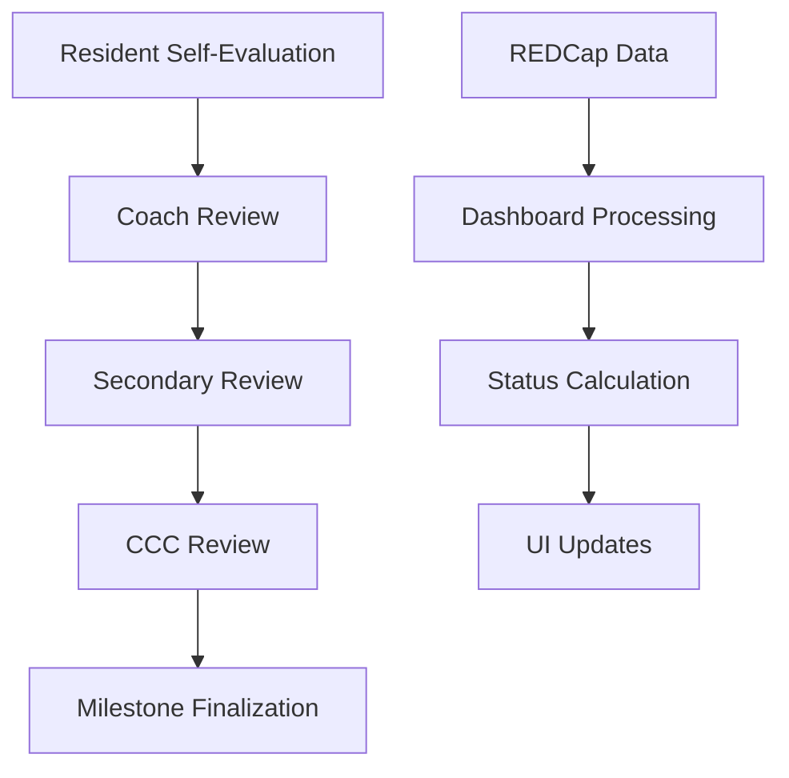

# IMSLU Dashboard

A comprehensive Shiny application for managing resident coaching sessions, milestone assessments, and CCC (Clinical Competency Committee) reviews at the Internal Medicine Residency Program at Saint Louis University.

## Overview

The IMSLU Dashboard provides a centralized platform for:
- **ILP and Milestone Review**: Comprehensive review system for resident progress tracking
- **Coaching Sessions**: Tools for primary and secondary coach reviews
- **CCC Reviews**: Clinical Competency Committee review and documentation
- **Milestone Assessment**: Interactive milestone evaluation with editing capabilities
- **Progress Tracking**: Visual status indicators for completion tracking

## Features

### 🔐 Access Control
- Secure access code authentication
- Role-based navigation system
- Session management

### 📊 Dashboard Views
- **All Residents Table**: Comprehensive status tracking with filtering options
- **Individual Review Pages**: Detailed resident assessment interface
- **Milestone Visualization**: Spider plots for self and program assessments
- **Progress Indicators**: Real-time completion status tracking

### 🎯 Review Types
- **Primary Coach Reviews**: Complete ILP assessment and milestone review
- **Secondary Reviews**: Validation and additional commentary
- **CCC Reviews**: Clinical committee assessments with milestone editing

### 🔄 Data Integration
- **REDCap Integration**: Seamless data synchronization
- **Real-time Updates**: Live status tracking
- **Multi-source Data**: Combines coaching, evaluation, and milestone data

## Technical Stack

- **Framework**: R Shiny with `bslib` for modern UI
- **Data**: REDCap API integration
- **Visualization**: `ggplot2` with custom milestone plots
- **Interactive Tables**: `DT` with custom JavaScript
- **UI Components**: Bootstrap 5 with custom CSS
- **Dependencies**: See `global.R` for complete package list

## Installation & Setup

### Prerequisites
- R (version 4.0+)
- Required R packages (see Dependencies section)
- REDCap API access tokens
- Valid network access to REDCap instance

### Quick Start

1. **Clone the repository**:
```bash
git clone https://github.com/your-username/imslu-dashboard.git
cd imslu-dashboard
```

2. **Install dependencies**:
```r
# Install required packages
source("R/global.R")  # This will install missing packages
```

3. **Configure REDCap access**:
   - Copy `config.yml.template` to `config.yml`
   - Add your REDCap API tokens:
```yaml
default:
  eval_token: "your_evaluation_token_here"
  rdm_token: "your_resident_data_token_here"
  fac_token: "your_faculty_token_here"
```

4. **Set environment variables** (for production):
```bash
export ACCESS_CODE="your_secure_access_code"
export EVAL_TOKEN="your_eval_token"
export RDM_TOKEN="your_rdm_token"
export FAC_TOKEN="your_fac_token"
```

5. **Run the application**:
```r
shiny::runApp()
```

## File Structure

```
├── R/
│   ├── global.R              # Configuration and data loading
│   ├── ui.R                  # User interface definition
│   ├── server.R              # Server logic and reactivity
│   ├── helpers.R             # Utility functions and data processing
│   ├── modules.R             # Shiny modules for milestone assessment
│   └── redcap_submission.R   # REDCap API integration functions
├── www/
│   ├── styles.css            # Custom CSS styling
│   └── app.js               # Custom JavaScript functions
├── config.yml.template      # Configuration template
├── .gitignore               # Git ignore file
└── README.md               # This file
```

## Dependencies

### Core Packages
```r
# UI and Framework
library(shiny)
library(shinyjs)
library(bslib)
library(htmltools)

# Data Processing
library(dplyr)
library(tidyr)
library(purrr)
library(data.table)

# Visualization
library(ggplot2)
library(gganimate)
library(DT)
library(reactable)

# REDCap Integration
library(redcapAPI)
library(REDCapR)
library(httr)

# Utilities
library(config)
library(stringr)
library(xml2)
library(fontawesome)
```

### Custom Package
```r
library(gmed)  # GMED package with REDCap functions and updated graphs
```

## Configuration

### Environment Variables
- `ACCESS_CODE`: Secure access code for application entry
- `EVAL_TOKEN`: REDCap API token for evaluation data
- `RDM_TOKEN`: REDCap API token for resident data management
- `FAC_TOKEN`: REDCap API token for faculty data

### REDCap Configuration
- **URL**: `https://redcapsurvey.slu.edu/api/`
- **Required Forms**: 
  - `resident_data`
  - `faculty_evaluation`
  - `ilp`
  - `s_eval`
  - `scholarship`
  - `ccc_review`
  - `coach_rev`
  - `second_review`
  - `milestone_entry`

## Usage

### For Coaches
1. **Access the Application**: Enter your access code
2. **Select "ILP and Milestone Review"**
3. **Review Dashboard**: Use filters to find residents
4. **Conduct Reviews**: Click on resident rows to start reviews
5. **Complete Assessments**: Fill out all required sections

### For CCC Members
1. **Review Completed Coaching Sessions**
2. **Assess Milestone Progress**
3. **Edit Milestones** (if concerns identified)
4. **Document Decisions and Follow-ups**

### Filtering Options
- **Sort by Level**: Organize residents by training level
- **Fully Complete**: Show only completed reviews
- **Self-Eval Done**: Residents ready for coach review
- **Coach Done**: Ready for secondary review
- **Reviews Done**: Ready for CCC review

## Data Flow



## API Integration

### REDCap Forms Used
- **resident_data**: Core resident information
- **coach_rev**: Primary coach reviews
- **second_review**: Secondary reviewer assessments
- **ccc_review**: CCC decisions and actions
- **milestone_entry**: Milestone assessments
- **s_eval**: Resident self-evaluations

### Data Synchronization
- Real-time status checking
- Automated period mapping
- Multi-instance form handling

## Development

### Adding New Features
1. **UI Changes**: Modify `R/ui.R`
2. **Server Logic**: Update `R/server.R`
3. **Helper Functions**: Add to `R/helpers.R`
4. **REDCap Integration**: Extend `R/redcap_submission.R`

### Testing
- Test with beta accounts in REDCap
- Validate period mappings
- Check milestone calculations
- Verify submission workflows

### Debugging
- Enable console logging for development
- Use browser developer tools for JavaScript issues
- Check REDCap API responses for data issues

## Deployment

### Posit Connect Cloud
1. **Prepare Environment Variables**
2. **Upload Application Files**
3. **Configure Scaling Settings**
4. **Test Production Access**

### Security Considerations
- Store API tokens securely
- Use environment variables in production
- Implement access logging
- Regular security updates

## Troubleshooting

### Common Issues

**Access Code Issues**
```r
# Check environment variable
Sys.getenv("ACCESS_CODE")
```

**REDCap Connection Problems**
```r
# Test API connection
httr::POST(url = "https://redcapsurvey.slu.edu/api/", 
           body = list(token = "your_token", content = "project"))
```

**Missing Data**
- Verify REDCap form permissions
- Check period mapping functions
- Validate resident level calculations

**UI Rendering Issues**
- Check JavaScript console for errors
- Verify CSS file loading
- Test responsive design elements

## Contributing

1. **Fork the repository**
2. **Create feature branch**: `git checkout -b feature/new-feature`
3. **Make changes and test thoroughly**
4. **Commit**: `git commit -m "Add new feature"`
5. **Push**: `git push origin feature/new-feature`
6. **Create Pull Request**

### Code Standards
- Follow existing naming conventions
- Add comments for complex logic
- Test all new functionality
- Update documentation as needed

## License

This project is intended for use within the Saint Louis University Internal Medicine Residency Program. Please contact the development team for usage permissions.

## Support

For technical support or feature requests:
- **GitHub Issues**: Create an issue in this repository
- **Development Team**: Contact the IMSLU IT team
- **Documentation**: Refer to inline code comments

## Changelog

### Version 1.0.0 (Current)
- Initial release with core functionality
- ILP and milestone review system
- CCC review capabilities
- REDCap integration
- Responsive dashboard design

---

**Last Updated**: December 2024  
**Maintained By**: IMSLU Development Team
